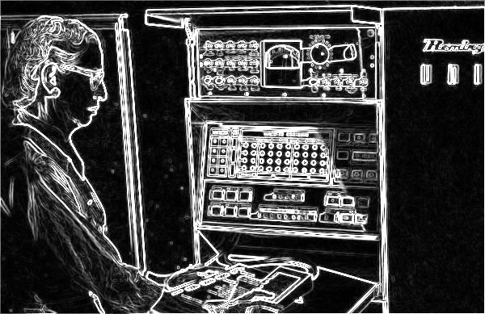
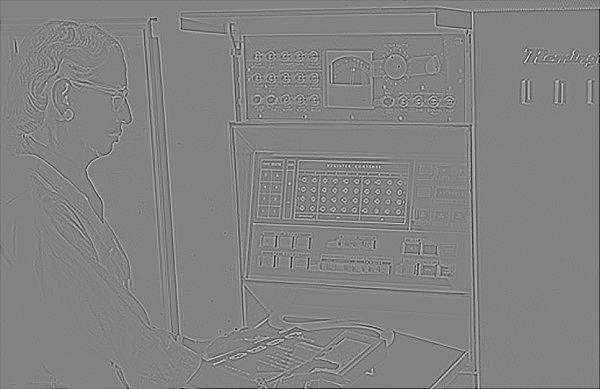

# README

## Description
This project is part of the Digital Image Processing course (MΥΕ037) at the University of Ioannina. The primary goal of this project is to learn and apply digital image processing techniques using Python and libraries such as Numpy, SciPy, and Matplotlib. The project focuses on image patch creation, normalization, convolution with Gaussian filters, edge detection using Sobel and Laplacian of Gaussian (LoG) operators.

## Features
- **Image Patches**: Divide a grayscale image into non-overlapping patches of 16x16 pixels and normalize each patch to have zero mean and unit variance.
- **Convolution and Gaussian Filtering**: Implement convolution and apply Gaussian filters to smooth the image.
- **Edge Detection**: Detect edges in the image using Sobel and Laplacian of Gaussian (LoG) operators.
- **Analysis and Plotting**: Visualize and analyze the results of the various image processing techniques applied.

## Technologies Used
- **Python 3.7+**
- **Numpy**: For numerical operations on arrays.
- **SciPy**: For advanced mathematical and scientific computations.
- **Matplotlib**: For plotting and visualizing results.

## Demo Images
### Original Image


### Gaussian Filtered Image


### Edge Detection with Sobel Operator


### Laplacian of Gaussian (LoG) Filter Results



## Setup and Usage
1. **Environment Setup**:
   - Install Python 3.7 or higher.
   - It is recommended to use Anaconda for managing the environment. Download and install Anaconda from [here](https://www.anaconda.com/download/).

2. **Install Required Libraries**:
   ```bash
   pip install numpy scipy matplotlib
   ```

3. **Run the Code**:
   - Ensure that the `grace_hopper.png` image is in the root directory.
   - Execute the `filters.py` script to perform image processing tasks:
     ```bash
     python filters.py
     ```

4. **View Results**:
   - The results of the processing will be saved in their respective directories (`image_patches`, `gaussian_filter`, `sobel_operator`, `log_filter`).
   - You can view the generated images using any image viewer.


   